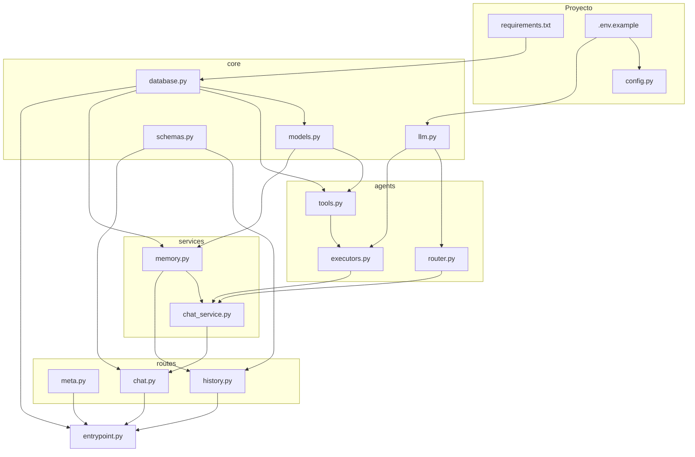

# Sistema Multi-Agente con Memoria Persistente

API REST con FastAPI, LangChain y SQLAlchemy.

## Estructura

```
├── entrypoint.py        # Arranque y app FastAPI
├── config.py            # Variables de entorno
├── core/                # Infraestructura compartida
│   ├── database.py
│   ├── models.py
│   ├── llm.py
│   └── schemas.py       # Contratos API (Pydantic)
├── agents/              # LangChain: router, ejecutores, tools
│   ├── tools.py
│   ├── router.py
│   └── executors.py
├── services/            # Lógica de negocio
│   ├── memory.py
│   └── chat_service.py
├── routes/              # Endpoints HTTP
│   ├── meta.py
│   ├── chat.py
│   └── history.py
└── requirements.txt
```

## Orden de creación manual

Sigue este orden para replicar el proyecto desde cero. Cada paso solo depende de los anteriores.

| Paso | Archivo | Depende de | Qué aporta |
|------|---------|------------|------------|
| 1 | `requirements.txt` | — | Dependencias pip |
| 2 | `.gitignore` | — | Ignorar `venv/`, `.env`, `*.db`, `__pycache__/` |
| 3 | `.env.example` | — | Plantilla `OPENAI_API_KEY`, `API_HOST`, `API_PORT` |
| 4 | `config.py` | `.env` (al ejecutar) | `load_dotenv()`, host y puerto |
| 5 | `core/database.py` | — | SQLite, `engine`, `SessionLocal`, `Base` |
| 6 | `core/models.py` | `core/database.py` | Tablas `Cliente` y `Mensaje` |
| 7 | `core/llm.py` | `.env` | Cliente `ChatOpenAI` |
| 8 | `core/schemas.py` | — | `ChatRequest`, `ChatResponse`, `HistoryResponse` |
| 9 | `agents/tools.py` | `core/database`, `core/models` | Tools `crear_cliente`, `consultar_clientes` |
| 10 | `agents/router.py` | `core/llm` | Clasificador crear / consultar |
| 11 | `agents/executors.py` | `agents/tools`, `core/llm` | Agentes LangChain con memoria |
| 12 | `services/memory.py` | `core/database`, `core/models` | Persistencia del historial por sesión |
| 13 | `services/chat_service.py` | `agents/*`, `services/memory` | Orquestación: router → agente → guardar |
| 14 | `routes/meta.py` | — | `GET /`, `GET /health` |
| 15 | `routes/history.py` | `core/schemas`, `services/memory` | Historial y borrado de sesión |
| 16 | `routes/chat.py` | `core/schemas`, `services/chat_service` | `POST /chat` |
| 17 | `entrypoint.py` | `core/database`, `routes/*` | App FastAPI, CORS, registro de routers |
| 18 | `.env` | `.env.example` | Copia local con tu API key (no subir a git) |
| 19 | `README.md` | — | Documentación |

### Flujo de dependencias



### Carpetas a crear antes de los archivos

```bash
mkdir -p core agents services routes
```

Luego crea los archivos en el orden de la tabla (pasos 1–17).

## Instalación

```bash
python -m venv venv
source venv/bin/activate   # Windows: venv\Scripts\activate
pip install -r requirements.txt
cp .env.example .env       # Editar OPENAI_API_KEY
```

## Uso

```bash
python entrypoint.py
# o
uvicorn entrypoint:app --reload --port 8004
```

Docs: http://localhost:8004/docs

## Endpoints

| Método | Ruta | Descripción |
|--------|------|-------------|
| GET | `/` | Info de la API |
| GET | `/health` | Estado |
| POST | `/chat` | Chat (header opcional `session-id`) |
| GET | `/history/{session_id}` | Historial |
| DELETE | `/history/{session_id}` | Borrar historial |

Ver `.env.example` para `OPENAI_API_KEY` y puerto.
